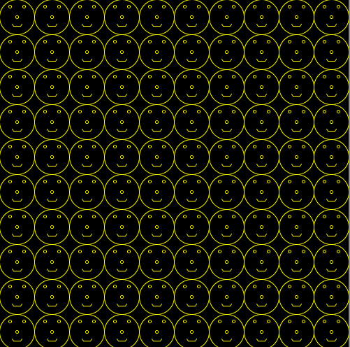

DT228-OOP
=========

Resources
---------
* [Webcourses](http://dit.ie/webcourses)
* [Slack]()
* [Processing](http://processing.org)
* [The Processing language reference](http://processing.org/reference/)
* [Learning Processing: A Beginner's Guide to Programming Images, Animation, and Interaction (Morgan Kaufmann Series in Computer Graphics)](http://http://www.learningprocessing.com/)
* [The Nature of Code](http://natureofcode.com/)
* [Eclipse](http://eclipse.org)
* [The git manual - read the first three chapters](http://git-scm.com/documentation)
* [A video tutorial all about git/github](https://www.youtube.com/watch?v=p_PGUltnB6w)
* [The Java Tutorial from Oracle](http://docs.oracle.com/javase/tutorial/)
* [Games Fleadh](http://www.gamesfleadh.ie/)
* [The Imagine Cup](https://www.imaginecup.com/)

## Contact the lecturer
Email: bryan.duggan@dit.ie

Twitter: [@skooter500](http://twitter.com/skooter500)

Slack: https://dt228-oop-2015.slack.com

# Semester 1

## Lab 1

### Learning Outcomes
- Sign up for the class Slack
- Become familiar with the syntax of Processing
- Become familiar with writing and running sketches in Processing
- Practice using variables
- Practice using loops
- Practice using nested loops and the if statement

Firstly, go to https://dt228-oop-2015.slack.com and sign up for the slack with your DIT email address. When you are signed up, send a little greeting to everyone on the #general channel. If you have a smartphone, you might want to install the Slack app. It's free. Also if you install the app, you will probably want to disable certain notifications, otherwise your phone will be buzzing every time someone posts anything. [Here is an article that explains how to do this](https://slack.zendesk.com/hc/en-us/articles/201649323-Channel-and-group-notification-preferences).

Take the time to look up the following methods in the [Processing language reference](http://processing.org/reference/ ) to make sure you are clear about the syntax and parameters:

* line
* ellipse
* rect
* background
* stroke
* fill
* size

Here are two shapes you can draw:

Try experimenting with colours!

Now try and figure out how to draw these patterns:

(Use variables as much as possible and use a loop in your solution)

Now try this one:

Finally try this one:

Notice the mouths

Feel free to experiment with colour!  

When you are finished with thes exercises, [log onto webcourses](http://dit.ie/webcourses) and complete the MCQ for this week

## Lecture 1
* [Introduction slides](https://onedrive.live.com/redir?resid=AB603D769EDBF24E!78307&authkey=!AAILJL-DwExqnac&ithint=file%2cpptx)
* [The program we wrote in class](processing/intro/intro.pde)
* [The contract for this course](http://1drv.ms/1DbmnG9)

Procedurally generated minnowforms video:

NILL - One of my game jam games. It uses lots of nice come sci stuff like Perlin noise, procedural generation and binary search

[NILL Sourcecode](http://github.com/skooter500/NILL)

Some Processing assignments from previous years: 

